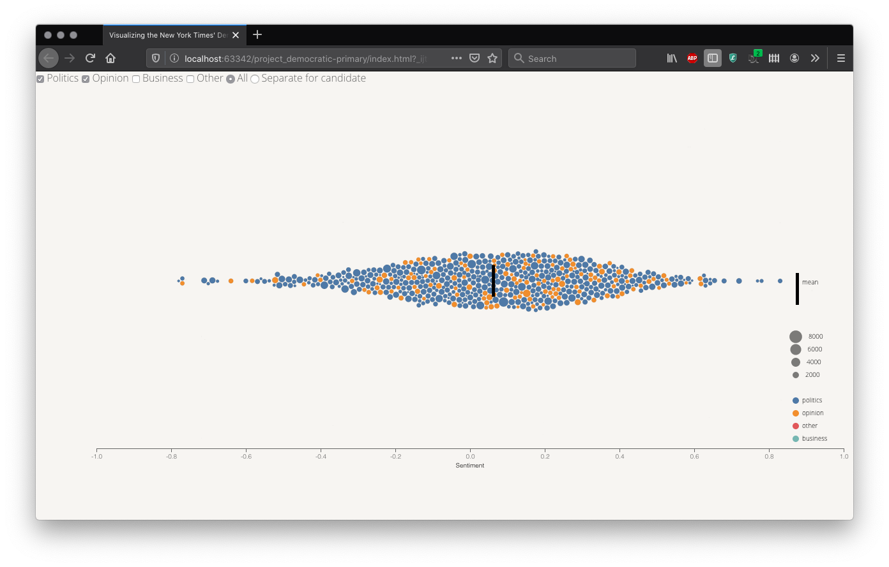
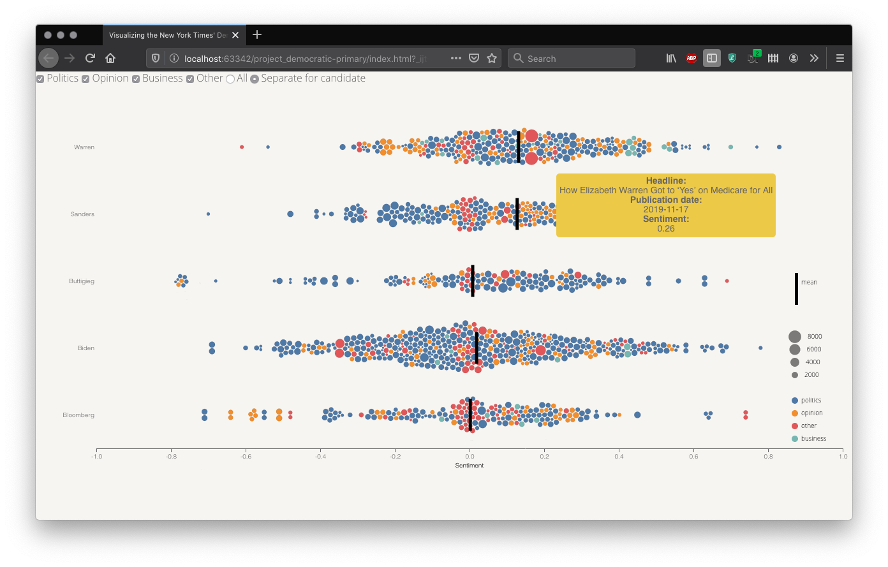
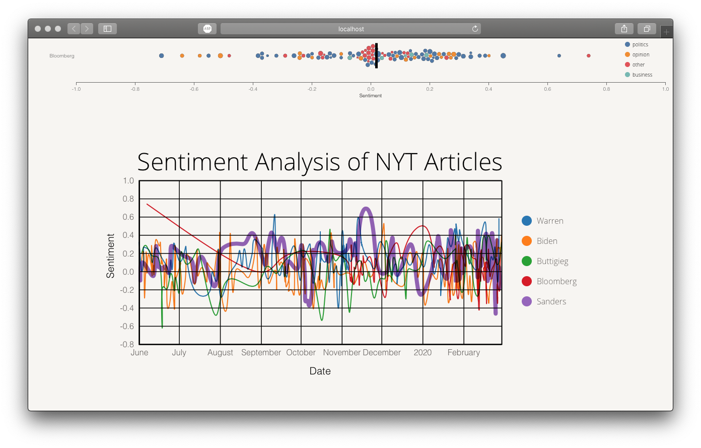
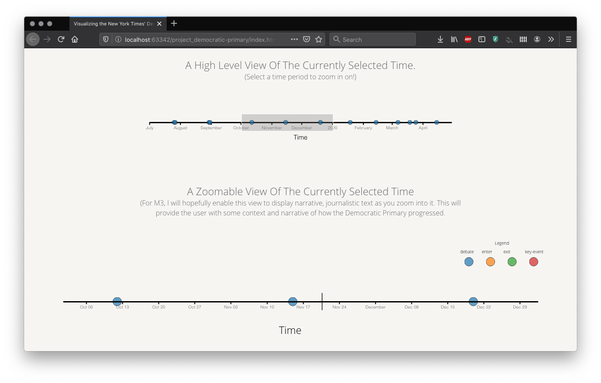

# Visualizing the New York Times' Democratic Primary Coverage

## Team members
- 85868164 Roger Yu-Hsiang Lo (GitHub id: `ylo`)
- 27463141 Jeff Miiller (GitHub id: `jmiiller`)
- 81430993 Mike Powar (GitHub id: `mpowar`)

## Design rationale

### View #1



- **Task abstraction:** This visualization is based on a bubble chart, with the goal of helping the reader **explore** and **compare** the trends in sentiment scores associated with each candidate across the four categories.
- **Data abstraction:** The attributes visualized in the current view include `Candidates` (categorical; 5 levels, with each level corresponding to one candidate), `Category` (categorical; 4 levels: business, politics, opinion, and other), `SentScore(Avg)` (quantitative; theoretical range: [-1, 1], actual range in the data: [-0.78, 0.83]), and `(word) Count` (quantitative; range: [56, 8179]).
- **Encoding:** Each entry is marked with a point, with the horizontal position encoding the sentiment score (`SentScore(Avg)`), the vertical position encoding (if the reader chooses *Separate for candidates*) the candidate associated with the entry in question, the size of the marker representing `(word) Count`, and color hues standing for `Category`. Bars (point marker) are also added, whose horizontal position reflect the means of the sentiment scores of visible data entries.
- **Interactivity:** In the current stage only two widgets are implemented: one for controlling which categories are depicted in the view, and the other for whether the data points for different candidates should be split vertically. We opted to checkbox different categories as there are only four categories, and using checkboxes allows the reader to choose which combinations of categories to visualize. The other widget we implemented is a pair of radio buttons that allow the reader to choose whether to split the data according to candidates.

### View #2


### View #3

- **Task abstraction:** This visualization is an overview-detail timeline that, crucially, will also be linked with the Average Sentiment line chart view in M3.  The linking will be such that you can select different time periods of the time axis to view, and the data/axis will dynamically change according to the selected time period. These two views are linked in such a manner that we must consider them in unison for particular tasks that we wish to allow the user to accomplish. On its own, the focus + context timeline will allow the user to explore and identify a timeline of key events from the Democratic primary, such as primary debates, and when politicians exit/enter the race. Combined with the Average Sentiment line chart view, the two views will allow the user to discover, locate, and compare trends and outliers in the NYT media coverage of candidates (as measured by the sentiment analysis) in relation to key events in the primary. For example, a trend a user might discover is the following: whenever a new front-runner emerges in the Democratic primary, the NYT runs a flurry of negative articles on the candidate the following week. Furthermore, the linked views will allow users to explore and compare the coverage of candidates over different time periods of the primary
- **Data abstraction:** The attributes visualized in the current view include Date (ordinal; 305 levels (July 1st, 2019 - May 1st, 2020), with each level corresponding to one day), Event-Type (categorical; 4 levels: debate, politician-enters-race, politician-exits-race, and a generic ‘key-events’ for remaining events).
- **Encoding:** Each entry is marked with a point, with the horizontal position encoding Date and color hues standing for Event-Type. Bars (point marker) are also added, whose horizontal position reflect the means of the sentiment scores of visible data entries. I used horizontal position on a common scale to visually encode Date, since it is the most effective magnitude channel for ordered attributes. I used color hue to encode Event-Type, since it is the second most effective identity channel for nominal attributes (and it wouldn’t make sense to use spatial position in this view).
- **Interactivity:** The central interactivity feature of the timeline is that we facet the date by juxtaposing two timelines, with the same encoding, in an overview-detail pattern. In particular, we have a overview timeline of the entire democratic primary, which, using an interactive brush, can allow the user to navigate/select a particular time period. By selecting a particular time period, the user selects a subset of the timeline data to display in the detail timeline view. In M3, this overview timeline will be linked to the Average Sentiment line chart view. 

## Changes in vision

Most elements in our visualizations are implemented as described in the proposal. However, the patterns revealed in the visualizations are not as clear-cut as expected. In particular, the sentiment scores among candidates are rather similar. While this does not impact our visualizations, it does undermine the claims we can infer from the data.

Some potential causes for this lack of distinct patterns are:

- As described in the data preprocessing section, we only consider articles whose headline mentioned one and only one candidates. We excluded articles that mentioned multiple candidates because there is no straightforward way to assign sentiment score for each candidate in such cases.
- We only calculated sentiment scores based on the headline, abstract, or lead paragraph of an article, as the entire text was not available using the NYT API. It is reasonable to assume that doing sentiment analysis on the entire text can potentially provide a more clear picture.
- In some cases, the sentiment scores estimated using the three text chunks (i.e., headline, abstract, and lead paragraph) are not consistently — with one score being negative and another one positive. This is why we used the average over the three scores, in an attempt to mitigate the effect of this inconsistency. However, this might also hide the underlying patterns.

## Data preprocessing

All the datasets used in the current project can be found in [data](./data/) folder.

The data View #1 and View #2 are based on were scraped from the NYT, using the application programming interface (API) service of the NYT ([https://developer.nytimes.com/apis](https://developer.nytimes.com/apis)). The Python script that did the scraping and handled data preprocessing is included in [script](./script/) folder. In what follows, we provide a detailed data preprocessing pipeline.

- This dataset contains information about articles published between June 2019 and February 2020 in the JavaScript Object Notation (JSON) format, with a snippet of the raw data shown below:
```json
{
                "_id": "nyt://article/65afb39e-cb64-5243-a4d6-f6367f4efb43",
                "abstract": "President Trump invites dirty tricks in a filthy way.",
                "blog": [],
                "byline": {
                    "organization": null,
                    "original": "By Maureen Dowd",
                    "person": [
                        {
                            "firstname": "Maureen",
                            "lastname": "Dowd",
                            "middlename": null,
                            "organization": "",
                            "qualifier": null,
                            "rank": 1,
                            "role": "reported",
                            "title": null
                        }
                    ]
                },
                "document_type": "article",
                "headline": {
                    "content_kicker": null,
                    "kicker": "Op-Ed Columnist",
                    "main": "A Down and Dirty White House",
                    "name": null,
                    "print_headline": "A Down and Dirty White House",
                    "seo": null,
                    "sub": null
                },
                "keywords": [
                    {
                        "major": "N",
                        "name": "subject",
                        "rank": 1,
                        "value": "United States Politics and Government"
                    },
                    {
                        "major": "N",
                        "name": "persons",
                        "rank": 2,
                        "value": "Conway, Kellyanne"
                    },
                    {
                        "major": "N",
                        "name": "persons",
                        "rank": 3,
                        "value": "Trump, Donald J"
                    },
                    {
                        "major": "N",
                        "name": "subject",
                        "rank": 4,
                        "value": "Ethics and Official Misconduct"
                    }
                ],
                "lead_paragraph": "WASHINGTON \u2014 It is very disorienting when those who are supposed to be our highest moral exemplars have no morals \u2014 not even of the alley-cat variety.",
                "multimedia": [
                    {
                        "caption": null,
                        "credit": null,
                        "crop_name": "articleLarge",
                        "height": 480,
                        "legacy": {
                            "xlarge": "images/2019/06/16/opinion/sunday/16Dowd/16Dowd-articleLarge.jpg",
                            "xlargeheight": 480,
                            "xlargewidth": 600
                        },
                        "rank": 0,
                        "subType": "xlarge",
                        "subtype": "xlarge",
                        "type": "image",
                        "url": "images/2019/06/16/opinion/sunday/16Dowd/16Dowd-articleLarge.jpg",
                        "width": 600
                    },
                    {
                        "caption": null,
                        "credit": null,
                        "crop_name": "jumbo",
                        "height": 820,
                        "legacy": [],
                        "rank": 0,
                        "subType": "jumbo",
                        "subtype": "jumbo",
                        "type": "image",
                        "url": "images/2019/06/16/opinion/sunday/16Dowd/16Dowd-jumbo.jpg",
                        "width": 1024
                    },
                    {
                        "caption": null,
                        "credit": null,
                        "crop_name": "superJumbo",
                        "height": 1639,
                        "legacy": [],
                        "rank": 0,
                        "subType": "superJumbo",
                        "subtype": "superJumbo",
                        "type": "image",
                        "url": "images/2019/06/16/opinion/sunday/16Dowd/16Dowd-superJumbo.jpg",
                        "width": 2048
                    },
                    {
                        "caption": null,
                        "credit": null,
                        "crop_name": "thumbStandard",
                        "height": 75,
                        "legacy": {
                            "thumbnail": "images/2019/06/16/opinion/sunday/16Dowd/16Dowd-thumbStandard.jpg",
                            "thumbnailheight": 75,
                            "thumbnailwidth": 75
                        },
                        "rank": 0,
                        "subType": "thumbnail",
                        "subtype": "thumbnail",
                        "type": "image",
                        "url": "images/2019/06/16/opinion/sunday/16Dowd/16Dowd-thumbStandard.jpg",
                        "width": 75
                    },
                    {
                        "caption": null,
                        "credit": null,
                        "crop_name": "thumbLarge",
                        "height": 150,
                        "legacy": [],
                        "rank": 0,
                        "subType": "thumbLarge",
                        "subtype": "thumbLarge",
                        "type": "image",
                        "url": "images/2019/06/16/opinion/sunday/16Dowd/16Dowd-thumbLarge.jpg",
                        "width": 150
                    }
                ],
                "news_desk": "OpEd",
                "print_page": "11",
                "pub_date": "2019-06-15T19:18:14+0000",
                "section_name": "Opinion",
                "snippet": "President Trump invites dirty tricks in a filthy way.",
                "source": "The New York Times",
                "subsection_name": "Sunday Review",
                "type_of_material": "Op-Ed",
                "uri": "nyt://article/65afb39e-cb64-5243-a4d6-f6367f4efb43",
                "web_url": "https://www.nytimes.com/2019/06/15/opinion/sunday/dowd-trump-.html",
                "word_count": 885
            }
```

- The values from the following fields — `main headline`, `abstract`, `lead_paragraph`, `news_desk`, `pub_date`, `snippet`, `word_count` — were extracted from each article. However, only the articles whose main headline mentioned one of the five candidates (i.e., Joe Biden, Michael Bloomberg, Pete Buttigieg, Bernie Sanders, and Elizabeth Warren) were included in the final dataset. Note also that in the current project we focus only on the articles of which the headline only contained one and only one candidate. That is, articles whose headline contained the names of two or more candidates were excluded from the dataset. We did this to simplify our analysis, as we do not have a good way to associate a single sentiment score of an article with multiple candidates. We also excluded articles that had a `word_count` of 0. In total, this procedure resulted in 739 entries in the final dataset.
- We then calculated the sentiment score for each article using the polarity sentiment analyzer from the Python library `vaderSentiment`. For each article, we calculated four [compound polarity scores](https://medium.com/analytics-vidhya/simplifying-social-media-sentiment-analysis-using-vader-in-python-f9e6ec6fc52f), on the basis of `main headline`, `abstract`, `lead_paragraph`, and the average of them respectively. That is, each article has four sentiment scores: `score_headline`, `score_abstract`, `score_paragraph`, and `average` (from the three scores).
- For each article, we also classified it into one of the four categories — `business`, `politics`, `opinion`, and `other`, based on the `news_desk` field of the article. The category `business` has articles from the news desks of business, business day, and sunday business; `politics` has those from politics, national, U.S., and Washington; `opinion` contains those from editorial, opinion, oped, and upshot; finally, `other` consists of the articles that do not fall into one of the aforementioned categories.
- The final dataset is stored in the CSV format, the first few lines of which are shown below:

```csv
"Date","Candidates","NewsDesk","Category","SentScore(headline)","SentScore(abstract)","SentScore(lead)","SentScore(Avg)","Count"
"2019-06-01","Warren","national","politics",0.0,0.49,0.48,0.32,1317
"2019-06-02","Sanders","oped","opinion",0.0,-0.42,0.13,-0.1,904
"2019-06-02","Warren","society","other",0.0,0.0,0.53,0.18,200
```

- The data currently plotted in View #3 comes from https://en.wikipedia.org/wiki/2020_Democratic_Party_presidential_debates. It is a schedule of the democratic debates, which have been scraped into the following form:
```csv
Debate,Date,Time(ET),Viewers,Location,Sponsor(s),Moderator(s)
1A,"June 26 2019",9–11 p.m.,"~24.3 million (15.3m live TV; 9m streaming)","Arsht Center,Miami, Florida","NBC News MSNBC Telemundo","Jose Diaz-Balart Savannah Guthrie Lester Holt Rachel Maddow Chuck Todd"
1B,"June 27 2019",9–11 p.m.,"~27.1 million (18.1m live TV; 9m streaming)","Arsht Center,Miami, Florida","NBC News MSNBC Telemundo","Jose Diaz-Balart Savannah Guthrie Lester Holt Rachel Maddow Chuck Todd"
```
- The data processing pipeline required me to remove some artifacts from the scraping, which is done in js/timeline/data-cleaning.js. Furthermore, I was required to parse their date format into JavaScript Date objects. 

## Project management & team assessment

### Status update

| **Tasks**                     | **Est. time** | **Actual time** | **Implementer** |
|-------------------------------|----------:|-----------:|-------------|
| **Data collection/preprocessing** |           |             |             |
| Scrape data with NYT API      |         3 |           2 | RL          |
| Sent. analysis/preprocess     |         4 |           4 | RL          |
| **Visualization**                 |           |             |             |
| Layout/placement of widgets   |         4 |           1 | RL          |
| **View #1**                       |           |             |             |
| Static bubble chart           |         2 |           3 | RL          |
| Legends                       |         1 |           1 | RL          |
| `d3` force implementation     |         2 |           5 | RL          |
| Add interactibility           |         3 |           4 | RL          |
| Add candidate filter widget   |         3 |           2 | RL          |
| **View #2**                       |           |             |             |
| Static line chart             |        10 |             | MP          |
| Add interactability           |        10 |             | MP          |
| Month selection widget        |       6.5 |             | MP          |
| **View #3**                       |           |             |             |
| Political context data        |         3 |   3          | MP, JM      |
| Legends                       |         8 |   4          | JM          |
| Add View #3                   |        16 |   16          | JM          |
| Link all views                |         8 |  8           | MP, JM      |
| **Project write-up**              |           |             |             |
| **M1**                            |         6 |           6 | RL, MP, JM  |
| **M2**                            |           |             |             |
| Write-up                      |         4 |  4           | RL, MP, JM  |
| Proj. manage & assess         |         3 |  3           | RL, MP, JM  |
| Submission                    |         3 |             | RL          |
| **M3**                            |           |             |             |
| Write-up                      |         6 |           - | RL, MP, JM  |
| Demo prep                     |         5 |           - | RL, MP, JM  |
| Submission                    |       1.5 |           - | RL          |

### Contributions breakdown

| Name               | Contributions |
|--------------------|-----------|
| Roger Yu-Hsiang Lo | Data collection and preprocessing. Implementation of View #1.|
| Jeff Miiller       | Implementation of View #3. Data collection of polling data for M3. Data processing of democratic debate data for View #3.|
| Mike Powar         | |

### Team assessment

|                                                                 | Weak | Satisfactory | Good | Excellent | Actions taken |
|-----------------------------------------------------------------|------|--------------|------|-----------|---------------|
| Team has a clear vision of the problem(s)                       |      |              |      |:heavy_check_mark:| One of the problems that we encountered is the animation of the bubble chart: with force simulation running on the background, the circles are not animated to the desired positions. We will consult TAs with regard to this problem.|
| Team is properly organized to complete task and cooperates well |      |              |      |:heavy_check_mark:|               |
| Team managed time wisely                                        |      |              |      |:heavy_check_mark:|               |
| Team acquired needed knowledge base                             |      |              |      |:heavy_check_mark:|               |
| Efforts communicated well within group                          |      |              |      |:heavy_check_mark:|               |
