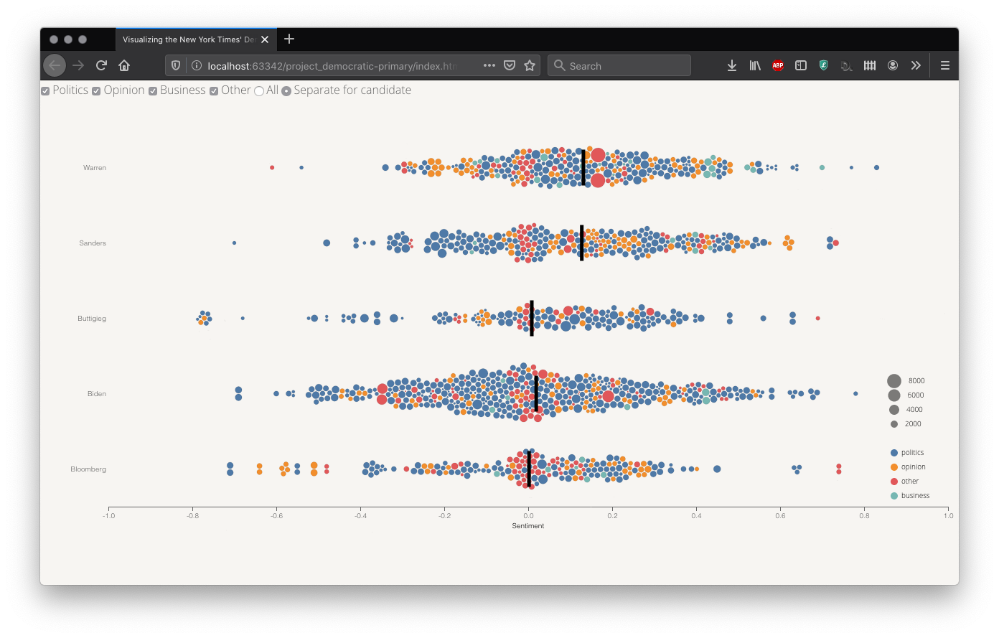

# Visualizing the New York Times' Democratic Primary Coverage

## Team members
- 85868164 Roger Yu-Hsiang Lo (GitHub id: `ylo`)
- 27463141 Jeff Miiller (GitHub id: `jmiiller`)
- 81430993 Mike Powar (GitHub id: `mpowar`)

## Design rationale

### View #1


### View #2


### View #3


## Changes in vision

## Data preprocessing

All the datasets used in the current project can be found in [data](./data/) foler.

The data View #1 and View #2 are based on were scraped from the NYT, using the application programming interface (API) service of the NYT ([https://developer.nytimes.com/apis](https://developer.nytimes.com/apis)). The Python script that did the scraping and handled data preprocessing is included in [script](./script/) folder. In what follows, we provide a detailed data preprocessing pipeline.

- This dataset contains information about articles published between June 2019 and February 2020 in the JavaScript Object Notation (JSON) format, with a snippet of the raw data shown below:
```json
{
                "_id": "nyt://article/65afb39e-cb64-5243-a4d6-f6367f4efb43",
                "abstract": "President Trump invites dirty tricks in a filthy way.",
                "blog": [],
                "byline": {
                    "organization": null,
                    "original": "By Maureen Dowd",
                    "person": [
                        {
                            "firstname": "Maureen",
                            "lastname": "Dowd",
                            "middlename": null,
                            "organization": "",
                            "qualifier": null,
                            "rank": 1,
                            "role": "reported",
                            "title": null
                        }
                    ]
                },
                "document_type": "article",
                "headline": {
                    "content_kicker": null,
                    "kicker": "Op-Ed Columnist",
                    "main": "A Down and Dirty White House",
                    "name": null,
                    "print_headline": "A Down and Dirty White House",
                    "seo": null,
                    "sub": null
                },
                "keywords": [
                    {
                        "major": "N",
                        "name": "subject",
                        "rank": 1,
                        "value": "United States Politics and Government"
                    },
                    {
                        "major": "N",
                        "name": "persons",
                        "rank": 2,
                        "value": "Conway, Kellyanne"
                    },
                    {
                        "major": "N",
                        "name": "persons",
                        "rank": 3,
                        "value": "Trump, Donald J"
                    },
                    {
                        "major": "N",
                        "name": "subject",
                        "rank": 4,
                        "value": "Ethics and Official Misconduct"
                    }
                ],
                "lead_paragraph": "WASHINGTON \u2014 It is very disorienting when those who are supposed to be our highest moral exemplars have no morals \u2014 not even of the alley-cat variety.",
                "multimedia": [
                    {
                        "caption": null,
                        "credit": null,
                        "crop_name": "articleLarge",
                        "height": 480,
                        "legacy": {
                            "xlarge": "images/2019/06/16/opinion/sunday/16Dowd/16Dowd-articleLarge.jpg",
                            "xlargeheight": 480,
                            "xlargewidth": 600
                        },
                        "rank": 0,
                        "subType": "xlarge",
                        "subtype": "xlarge",
                        "type": "image",
                        "url": "images/2019/06/16/opinion/sunday/16Dowd/16Dowd-articleLarge.jpg",
                        "width": 600
                    },
                    {
                        "caption": null,
                        "credit": null,
                        "crop_name": "jumbo",
                        "height": 820,
                        "legacy": [],
                        "rank": 0,
                        "subType": "jumbo",
                        "subtype": "jumbo",
                        "type": "image",
                        "url": "images/2019/06/16/opinion/sunday/16Dowd/16Dowd-jumbo.jpg",
                        "width": 1024
                    },
                    {
                        "caption": null,
                        "credit": null,
                        "crop_name": "superJumbo",
                        "height": 1639,
                        "legacy": [],
                        "rank": 0,
                        "subType": "superJumbo",
                        "subtype": "superJumbo",
                        "type": "image",
                        "url": "images/2019/06/16/opinion/sunday/16Dowd/16Dowd-superJumbo.jpg",
                        "width": 2048
                    },
                    {
                        "caption": null,
                        "credit": null,
                        "crop_name": "thumbStandard",
                        "height": 75,
                        "legacy": {
                            "thumbnail": "images/2019/06/16/opinion/sunday/16Dowd/16Dowd-thumbStandard.jpg",
                            "thumbnailheight": 75,
                            "thumbnailwidth": 75
                        },
                        "rank": 0,
                        "subType": "thumbnail",
                        "subtype": "thumbnail",
                        "type": "image",
                        "url": "images/2019/06/16/opinion/sunday/16Dowd/16Dowd-thumbStandard.jpg",
                        "width": 75
                    },
                    {
                        "caption": null,
                        "credit": null,
                        "crop_name": "thumbLarge",
                        "height": 150,
                        "legacy": [],
                        "rank": 0,
                        "subType": "thumbLarge",
                        "subtype": "thumbLarge",
                        "type": "image",
                        "url": "images/2019/06/16/opinion/sunday/16Dowd/16Dowd-thumbLarge.jpg",
                        "width": 150
                    }
                ],
                "news_desk": "OpEd",
                "print_page": "11",
                "pub_date": "2019-06-15T19:18:14+0000",
                "section_name": "Opinion",
                "snippet": "President Trump invites dirty tricks in a filthy way.",
                "source": "The New York Times",
                "subsection_name": "Sunday Review",
                "type_of_material": "Op-Ed",
                "uri": "nyt://article/65afb39e-cb64-5243-a4d6-f6367f4efb43",
                "web_url": "https://www.nytimes.com/2019/06/15/opinion/sunday/dowd-trump-.html",
                "word_count": 885
            }
```

- The values from the following fields — `main headline`, `abstract`, `lead_paragraph`, `news_desk`, `pub_date`, `snippet`, `word_count` — were extracted from each article. However, only the articles whose main headline mentioned one of the five candidates (i.e., Joe Biden, Michael Bloomberg, Pete Buttigieg, Bernie Sanders, and Elizabeth Warren) were included in the final dataset. Note also that in the current project we focus only on the articles of which the headline only contained one and only one candidate. That is, articles whose headline contained the names of two or more candidates were excluded from the dataset. We did this to simplify our analysis, as we do not have a good way to associate a single sentiment score of an article with multiple candidates. In total, this procedure resulted in 1287 entries in the final dataset.
- We then calculated the sentiment score for each article using the polarity sentiment analyzer from the Python library `vaderSentiment`. For each article, we calculated four [compound polarity scores](https://medium.com/analytics-vidhya/simplifying-social-media-sentiment-analysis-using-vader-in-python-f9e6ec6fc52f), on the basis of `main headline`, `abstract`, `lead_paragraph`, and the average of them respectively. That is, each article has four sentiment scores: `score_headline`, `score_abstract`, `score_paragraph`, and `average` (from the three scores).
- For each article, we also classified it into one of the four categories — `business`, `politics`, `opinion`, and `other`, based on the `news_desk` field of the article. The category `business` has articles from the news desks of business, business day, and sunday business; `politics` has those from politics, national, U.S., and Washington; `opinion` contains those from editorial, opinion, oped, and upshot; finally, `other` consists of the articles that do not fall into one of the aforementioned categories.
- The final dataset is stored in the CSV format, the first few lines of which are shown below:

```csv
"Date","Candidates","NewsDesk","Category","SentScore(headline)","SentScore(abstract)","SentScore(lead)","SentScore(Avg)","Count"
"2019-06-01","Warren","national","politics",0.0,0.49,0.48,0.32,1317
"2019-06-02","Sanders","oped","opinion",0.0,-0.42,0.13,-0.1,904
"2019-06-02","Warren","society","other",0.0,0.0,0.53,0.18,200
```
## Project management & team assessment

### Status update

### Contributions breakdown

### Team assessment

|                                                                 | Weak | Satisfactory | Good | Excellent | Actions taken |
|-----------------------------------------------------------------|------|--------------|------|-----------|---------------|
| Team has a clear vision of the problem(s)                       |      |              |      |:heavy_check_mark:|               |
| Team is properly organized to complete task and cooperates well |      |              |      |:heavy_check_mark:|               |
| Team managed time wisely                                        |      |              |      |:heavy_check_mark:|               |
| Team acquired needed knowledge base                             |      |              |      |:heavy_check_mark:|               |
| Efforts communicated well within group                          |      |              |      |:heavy_check_mark:|               |
